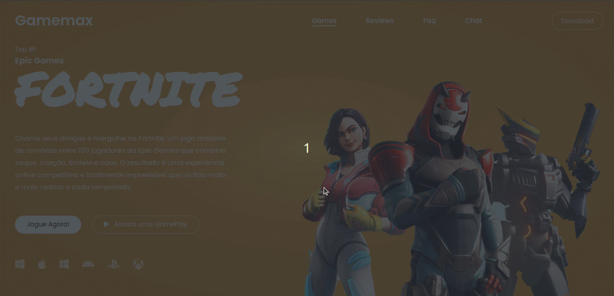

<h1 style="text-align: center; font-weight: bold;">Gamemax Fortnite Landing Page</h1>

## Demo 📸

  

---

## Sobre o Projeto

O projeto "Gamemax Fortnite Landing Page" é uma landing page interativa desenvolvida para o site da Gamemax, uma empresa especializada em jogos online e entretenimento. A landing page tem como objetivo fornecer aos jogadores de Fortnite uma experiência envolvente ao visitar o site da Gamemax, oferecendo informações úteis, notícias, atualizações e recursos exclusivos sobre o jogo.

### 🛠 Tecnologias

As seguintes ferramentas foram usadas na construção do projeto:

- [HTML](https://developer.mozilla.org/pt-BR/docs/Web/HTML)
- [CSS](https://developer.mozilla.org/pt-BR/docs/Web/CSS)
- [Google Fonts](https://fonts.google.com/)
- [Font Awesome](https://fontawesome.com/)

---

 

Veja meu Linkedin: [Leandro Dantas](https://www.linkedin.com/in/leandro-dantas-1959b711b/)
